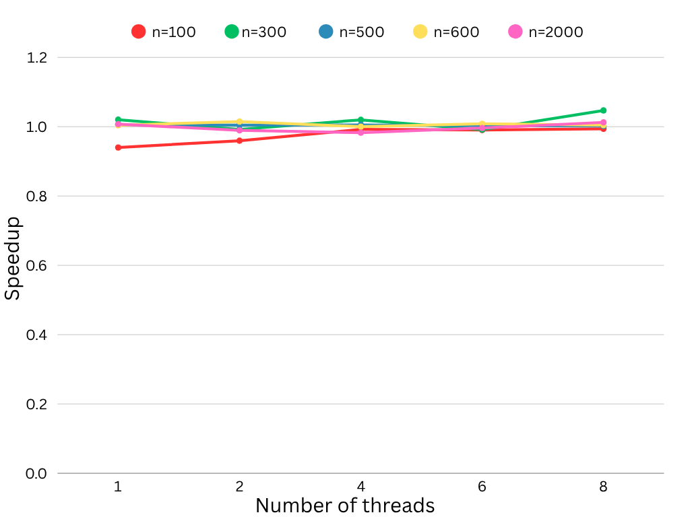

# Floyd-Warshall Using OpenMP
### Overview
This project implements a parallel version of Floyd-Warshall algorithm using OpenMP. The goal was to improve the performace compared to the sequential implementation.
### Parallelization Strategy
- This code uses OpenMP directive `#pragma omp parallel for` to parallelize the inner nested loop for the algorithm.
- The implementation doesn't contain any race condition, and there was no need for dynamic scheduling.
### How to compile 
- make sure you have GCC with openmp support.
- compile:
```bash
g++ -fopenmp -o floyd openmp.cpp
```
- Run the code:
```bash
./floyd
```

### Performance Comparison
#### Hardware used
- **CPU**: AMD Ryzen 5 5625u, 6 cores, 12 Threads.
- **RAM**: 16 GB.
- **OS**: Windows 11 WSL/Ubuntu 24.04.
#### Input sizes tested 
Tested for input sizes= 100, 300, 500, 600, 2000.
Threads= 1, 2, 4, 6, 8.

### Speedup Achieved
for n= 100
| Number of Threads | Sequential Time  | OpenMP Time | Speedup    | 
|-------------------|------------------|-------------|------------|
| 1                 | 0.010077s        | 0.01072     | 0.940019×  |
| 2                 | 0.010234s        | 0.010665s   | 0.959587×  |
| 4                 | 0.010223s        | 0.010303s   | 0.992235×  |
| 6                 | 0.010096s        | 0.010194s   | 0.990386×  |
| 8                 | 0.010117s        | 0.010178s   | 0.994007×  |

n = 300
| Number of Threads | Sequential Time   | OpenMP Time | Speedup   |
|-------------------|------------------|-------------|-----------|
| 1                 | 0.26377s         | 0.25855s    | 1.0202×   |
| 2                 | 0.26037s         | 0.26242s    | 0.99218×  |
| 4                 | 0.26601s         | 0.26086s    | 1.01976×  |
| 6                 | 0.26013s         | 0.26239s    | 0.99141×  |
| 8                 | 0.27207s         | 0.25988s    | 1.04692×  |

n = 500
| Number of Threads | Sequential Time  | OpenMP Time | Speedup   |
|-------------------|------------------|-------------|-----------|
| 1                 | 1.231s           | 1.22342s    | 1.0062×   |
| 2                 | 1.25554s         | 1.24974s    | 1.00464×  |
| 4                 | 1.13384s         | 1.12804s    | 1.00515×  |
| 6                 | 1.13262s         | 1.12938s    | 1.00287×  |
| 8                 | 1.1318s          | 1.1294s     | 1.00213×  |

n = 600
| Number of Threads | Sequential Time  | OpenMP Time | Speedup   |
|-------------------|------------------|-------------|-----------|
| 1                 | 1.9509s          | 1.94273s    | 1.0042×   |
| 2                 | 1.9768s          | 1.94777s    | 1.01491×  |
| 4                 | 1.93874s         | 1.93841s    | 1.00017×  |
| 6                 | 1.98436s         | 1.96762s    | 1.00851×  |
| 8                 | 1.96421s         | 1.95544s    | 1.00448×  |

n = 2000
| Number of Threads | Sequential Time  | OpenMP Time | Speedup   |
|-------------------|------------------|-------------|-----------|
| 1                 | 69.670371s       | 69.157938s  | 1.00741×  |
| 2                 | 69.891415s       | 70.636203s  | 0.989456× |
| 4                 | 70.740999s       | 71.980694s  | 0.982777× |
| 6                 | 70.693197s       | 70.963618s  | 0.982777× |
| 8                 | 71.871498s       | 70.980318s  | 1.012555× |





### Challenges Faced
- Thread overhead: the overhead of creating threads outweighed the benefits of paralelllism. which caused the parallel time to increase, causing less speedup comparing to the pthread version.

### Conclusion 
In this project, openmp was used to parallelize Floyd-Warshall Algorithm. While openmp provided an easier implementation and better abstraction for parallelizing loops, the actual performance gain was minimal. Speedup hovered around 1x, even for higher database and multiple threads.
Despite the limited speedup, the proejct demonstrated how openmp can be used to parallelize code with minimal effort.
